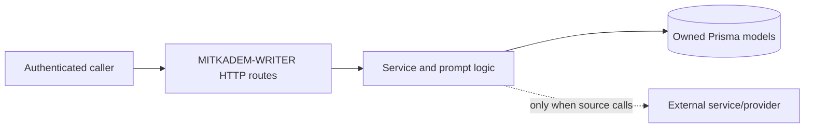
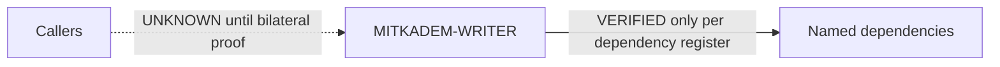

# 770 Node — MITKADEM-WRITER

> Canonical service truth. Evidence status vocabulary is limited to `VERIFIED`, `INFERRED`, `UNKNOWN`, and `CONTRADICTED`.

## Identity and business purpose

- Node: `MITKADEM-WRITER`; repository: `mitkadem-writer`; runtime: Node.js/TypeScript.
- `VERIFIED` purpose: Tenant-contextual copy and image-prompt generation. Evidence: `package.json` runtime scripts and active entry/route/service symbols at `cd2bcf89e325c72699611ee9dde6564d3d22500b`.
- Documented source commit: `cd2bcf89e325c72699611ee9dde6564d3d22500b`. Documentation task: `DOC-770-WRITER-001` (`REVIEW`).

## Responsibilities and explicit non-responsibilities

- `VERIFIED` Owns only behavior implemented by its active entry points, routes, services, and Prisma model(s) below.
- `VERIFIED` Does not own scheduling, publishing, policy verdicts, or production topology unless an explicit source call below proves a narrow handoff.
- `UNKNOWN` Marketing Brain orchestration or production wiring is not inferred from names, URLs, or historical documents.

## Runtime entry points and complete route inventory

- `VERIFIED` `GET /:id` — `src/routes/write.ts`
- `VERIFIED` `GET /diag` — `src/routes/health.ts`
- `VERIFIED` `GET /healthz` — `src/routes/health.ts`
- `VERIFIED` `GET /hints` — `src/routes/writer.ts`
- `VERIFIED` `GET /readyz` — `src/routes/health.ts`
- `VERIFIED` `POST /approve/:taskId` — `src/routes/writer.ts`
- `VERIFIED` `POST /brief` — `src/routes/write.ts`
- `VERIFIED` `POST /feedback` — `src/routes/writer.ts`
- `VERIFIED` `POST /mint` — `src/routes/dev.ts`
- `VERIFIED` `POST /reject/:taskId` — `src/routes/writer.ts`
- `VERIFIED` `POST /run` — `src/routes/write.ts`

Mounted prefixes are already included where literal in the route; router mounts and middleware order remain governed by the cited active source. Health/dev routes may intentionally precede authentication; all other authorization claims require the exact middleware binding.

## Workers, queues, cron, and timers

- `VERIFIED` timer/queue surface: `src/app.ts`
- `VERIFIED` timer/queue surface: `src/services/queue.service.ts`
- `VERIFIED` timer/queue surface: `src/services/worker.service.ts`

## Input/output contracts

- `VERIFIED` Request and response fields are those parsed/returned by the cited route handlers at the documented commit; permissive JSON is not promoted to a stronger schema.
- `UNKNOWN` Compatibility with any caller is not proven until both caller construction and callee parsing agree.

## Data ownership

- `VERIFIED` `WriteTask` fields: `id`, `tenantId`, `brief`, `tone`, `audience`, `status`, `content`, `createdAt`, `updatedAt`

- `UNKNOWN` Physical production database, schema deployment, retention, backup, and cross-service database permissions.

## State machines

- `VERIFIED` Persisted state literals are source-owned strings, not database enums. Active source must be consulted before adding a transition.
- `UNKNOWN` Recovery of tasks interrupted between side effects and terminal persistence.

## Provider/model behavior and prompt ownership

- `VERIFIED` source declaration `claude-sonnet-4-6`

- `VERIFIED` Prompt construction belongs to the active service functions that assemble prompt/messages; LLM Hub owns only gateway normalization when called.
- `UNKNOWN` Provider-side safety enforcement, availability, exact billed cost, and runtime model alias resolution.

## Tenant, frontend, niche, brand, market, and language propagation

- `VERIFIED` Tenant isolation is enforced only where handlers bind authenticated `tenantId` to queries or outbound bodies.
- `UNKNOWN` `frontendId` propagation unless explicitly parsed and forwarded in active source.
- `UNKNOWN` End-to-end brand/niche/market/language preservation beyond locally parsed and emitted fields.

## Dependencies, queues, and events

- `VERIFIED` Outbound dependencies are limited to literal active HTTP/queue/database calls in `src/`; configured URL names alone prove configuration, not a live relationship.
- `INFERRED` Shared JWT naming suggests service authentication compatibility; deployment key equality is `UNKNOWN`.
- `UNKNOWN` EVENTS/ORCHESTRATOR/CALENDAR integration unless an exact active call is identified in the Phase 2.4 dependency register.

## Retries, timeouts, idempotency, ordering, and concurrency

- `VERIFIED` Only explicit retry, timeout, cache, unique-key, queue, transaction, and ordering logic in active source applies.
- `UNKNOWN` Exactly-once delivery, distributed ordering, replay safety, and cross-service idempotency.

## Errors, fallbacks, observability, health, shutdown, and recovery

- `VERIFIED` HTTP error mapping and health behavior are implemented by the cited route/middleware surfaces.
- `VERIFIED` Logging uses service-local logger/request correlation where mounted.
- `UNKNOWN` Metrics backend, alert routing, graceful in-flight drain, disaster recovery, and production health history.

## Deployment and rollback evidence

- `VERIFIED` Repository contains build/start declarations; this proves intended packaging only.
- `UNKNOWN` Deployment platform, deployed commit, release promotion, rollback command, and rollback rehearsal.

## Security assumptions and policy boundaries

- `VERIFIED` Secret inventory below records names only. Credential values are never documentation evidence.
- `UNKNOWN` Production secret rotation and network-level access controls.
- `UNKNOWN` MITKADEM-POLICY enforcement unless an active authenticated call is proven; content scoring/safety is not silently equated with policy approval.

## Environment variable names

- `ADAPTERS_META_URL`
- `BRIEF_QUALITY_LOOKUP_BREAKER_COOLDOWN_SEC`
- `BRIEF_QUALITY_LOOKUP_BREAKER_FAILURE_THRESHOLD`
- `BRIEF_QUALITY_LOOKUP_ENABLED`
- `BRIEF_QUALITY_LOOKUP_RETRY_BASE_MS`
- `BRIEF_QUALITY_LOOKUP_RETRY_MAX_ATTEMPTS`
- `BRIEF_QUALITY_LOOKUP_RETRY_MAX_MS`
- `BRIEF_QUALITY_MIN_CLUSTER_SAMPLE`
- `DATABASE_URL_WRITER`
- `DEV_ADMIN_SECRET`
- `DIRECT_URL`
- `EVENTS_URL`
- `HOOK_BACKFILL_CRON`
- `INSIGHTS_URL`
- `LLM_HUB_URL`
- `LOG_LEVEL`
- `MARKETING_BRAIN_URL`
- `MB_BRAIN_URL`
- `NODE_ENV`
- `PORT`
- `PRIORS_CLIENT_BREAKER_COOLDOWN_SEC`
- `PRIORS_CLIENT_BREAKER_FAILURE_THRESHOLD`
- `PRIORS_CLIENT_RETRY_BASE_MS`
- `PRIORS_CLIENT_RETRY_MAX_ATTEMPTS`
- `PRIORS_CLIENT_RETRY_MAX_MS`
- `REDIS_URL`
- `SERVICE_JWT_SECRET`
- `SERVICE_NAME`
- `TENANT_BRAIN_URL`
- `TICK_TIDY_V2`
- `WRITER_FEWSHOT_EXAMPLES`
- `WRITER_GROUNDED_ARMS_ENABLED`

## Risks and contradictions

- `CONTRADICTED` Historical/system intent is not runtime truth where it disagrees with active source.
- `UNKNOWN` Backup and archived tracked files are not active runtime surfaces unless imported or invoked.

## Mermaid runtime diagram

## Mermaid relationship diagram

## UNKNOWN register

- `UNKNOWN`: production deployment and topology.
- `UNKNOWN`: deployed commit and rollback rehearsal.
- `UNKNOWN`: production provider availability and credentials.
- `UNKNOWN`: end-to-end caller/callee execution.
- `UNKNOWN`: runtime SLOs and alert ownership.

## Change-impact checklist

- Reinventory routes, workers/timers, state literals, Prisma fields, environment names, providers/models, prompts, auth, tenant/frontend/language fields, retries, and outbound contracts.
- Update Phase 2.4 registers and digest; rerun focused and complete validation on any tracked runtime-source drift.

## Verification

- Exact source commit: `cd2bcf89e325c72699611ee9dde6564d3d22500b`
- Branch/remote at preflight: `main` / `origin/main`, clean and `0/0` divergence.
- Verification date: `2026-07-14` (`Asia/Jerusalem`)
- Documentation confidence: `MEDIUM`
- Deployment state: `UNKNOWN`; production approval: false.
